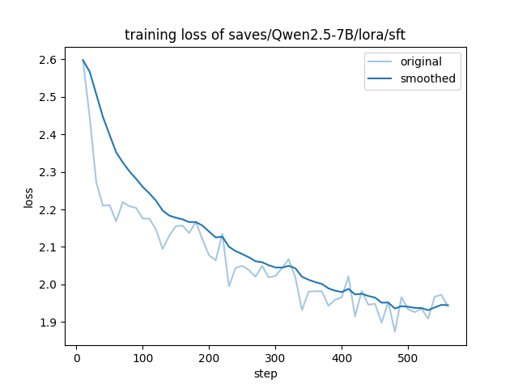
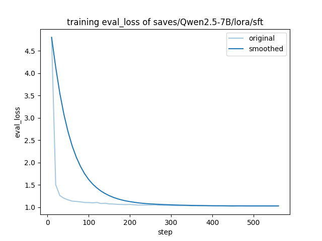
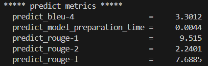
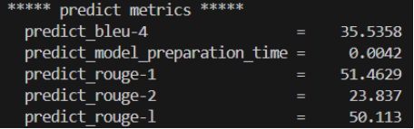

### 0. 项目说明

本项目为大模型实践的课程作业，主要目标是微调一个有关非遗项目的问答助手。

### 1. 项目文件说明

#### 1.1 可执行文件说明

- `raw_data_collection_web.py`：从中国非遗文化官网初步爬取数据的脚本，运行后会在 `raw_data_items`文件夹下按类别生成爬取后的 csv 文件。
- `raw_data_item_enrich.py`：按照初步爬取的数据对项目详情界面进行二次爬取丰富信息，运行后会在 `enrich_web_items` 文件夹下生成丰富版数据文件。
- `enrich_data_item_merge.py`：用于合并二次爬取得到的数据文件中的冗余信息，运行后会在`merged_web_items` 文件夹下生成压缩后的数据文件并在当前目录得到 `非遗项目_web.csv` 文件。
- `html_file_download.py`：用于下载百度百科搜索界面 HTML 源文件的脚本。
- `baidu_baike_collection.py`：用于从百度百科爬取/解析数据的脚本。
- `baidu_data_process.py/web_data_process.py`：使用 DeepSeek 清洗数据+数据格式整理的脚本
- `web_baidu_merge.py`：合并两个数据源数据的脚本。
- `QA_generate.py`：生成 QA 问答数据集的脚本。

#### 1.2 文件夹及其他文件说明

- `baidu_html_files`：用于存储 `html_file_download.py` 脚本下载的 HTML 源文件。
- `bert-base-chinese`：存储 BERT 模型权重，用于百度百科数据爬取过程的语义相似度分析。
- `enrich_web_items`、`merged_web_items`、`raw_data_items` 均用于存储临时数据文件（共计10个类别的项目数据）。
- `LLaMA-Factory`：包含用于 `Qwen2.5-7B-Instruct`微调、推理以及测试的配置文件。
- `Qwen2.5`：包含模型下载脚本（默认下载到 `Qwen2.5/model` 文件夹下）。
- `fake_useragent_0.1.11.json`：数据爬取过程中用于伪造数据头的辅助文件。
- `final_dataset.csv`：清洗完的最终数据集。
- `qa_dataset.json`：最终生成的用于微调的 QA 数据集文件。

### 2. Quick Start

#### 2.1 非遗官网数据爬取

按顺序依次执行下面三条命令

```bash
# 一阶段数据爬取
python raw_data_collection_web.py

# 二阶段数据爬取
python raw_data_item_enrich.py

# 冗余信息合并
python enrich_data_item_merge.py
```

#### 2.2 百度百科数据爬取

按顺序依次执行下面两条命令

```bash
# 爬取网页源文件
python html_file_download.py # 这一步需要使用 selenium，需要再本地或者有谷歌浏览器的终端运行

# 数据解析与清洗
python baidu_baike_collection.py
```

#### 2.3 DeepSeek API 清洗

使用之前需自行申请 DeepSeek 的 API-KEY 并填入 `baidu_data_process.py/web_data_process.py` 两文件的对应位置或者以环境变量形式存于终端。依次运行以下三条命令（前两条顺序可随意调换）：

```bash
# 百度百科数据清洗
python baidu_data_process.py

# 官网数据清洗
python web_baidu_merge.py

# 合并清洗后的两数据源
python web_baidu_merge.py
```

#### 2.4 QA 数据集制作

```bash
python QA_generate.py
```

为了适配后续的微调，本项目制作了 6 类问题，每类问题共 3 种不同 prompt 模板，具体设计见 `QA_generate.py` 源文件。

#### 2.5 LLaMA-Factory 微调

这部分内容请自行参考 [官方文档]([LLaMA Factory](https://llamafactory.readthedocs.io/zh-cn/latest/)) 及 [官方项目仓库](https://github.com/hiyouga/LLaMA-Factory)，我们提供了用于 `Qwen2.5-7B-Instruct` 微调、推理以及评估测试的配置文件，具体可见 `LLaMA-Factory` 文件夹。

>- **Qwen2.5-7B-Instruct-Lora.yaml**：Lora 微调配置
>- **Qwen2.5-7B-Instruct-evaluation.yaml**：基座模型评估配置
>- **Qwen2.5-7B-Instruct-Lora-evaluation.yaml**：Lora 微调模型评估配置
>- **Qwen2.5-7B-Instruct-Lora-inference.yaml**：Lora 微调模型推理配置

除此之外，Qwen2.5 文件夹下还包含了使用 vllm 进行基座模型推理的脚本（当然你也可以将其集成到 LLaMA-Facotry 中，参照 `Qwen2.5-7B-Instruct-Lora-inference.yaml` 稍微修改下配置即可）。

### 3. 微调结果

#### 3.1 微调损失变化





#### 3.2 微调前后模型评估结果

微调前：



微调后：



可以看到微调后模型的 BLEU 和 ROUGE 指标显著优于微调前基线，说明微调效果还不错。